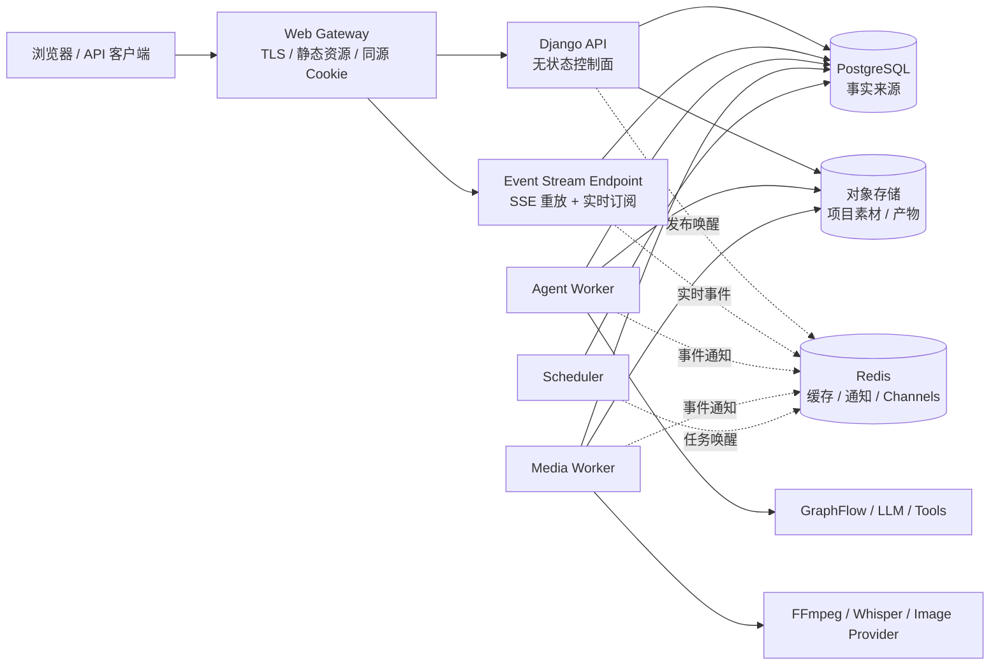
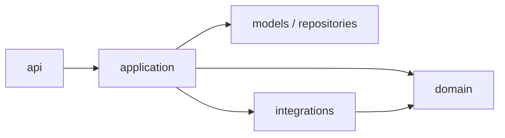
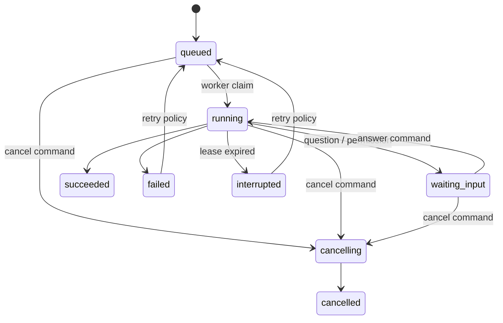

# Creation Agent Studio V2 架构设计

状态：提案（Proposed）
更新时间：2026-09-04
适用范围：`creation_agent_studio`

应用、聊天应用、Skill、引导问题和用户工作流的详细设计见 [APPLICATION_AND_WORKFLOW_V2.md](APPLICATION_AND_WORKFLOW_V2.md)。

## 1. 结论

V2 采用 **模块化单体（Modular Monolith）+ 独立执行 Worker + 统一运行事件协议**：

- Django API 保持为一个可水平扩展、无状态的控制面，不在请求进程中保存 Agent 会话或启动后台线程。
- Agent、应用和媒体任务统一由 Execution 模块建模，由独立 Worker 执行。
- PostgreSQL 是业务状态、运行状态和事件的唯一事实来源；Redis 只负责通知、缓存和实时扇出，Redis 故障不应造成业务状态丢失。
- React 前端按业务 Feature 组织；服务端状态交给查询缓存，Zustand 仅保存短生命周期 UI 状态。
- 浏览器只消费版本化 REST API 和统一 Run Event Stream，不再分别理解 SSE Agent 状态机和 WebSocket Job 状态机。

这不是一次微服务拆分。当前业务规模下，先建立清晰模块边界和稳定协议，比增加服务数量更重要。执行平面因资源隔离、长任务和故障恢复要求独立部署，其余业务保留在同一 Django 代码库和数据库中。

## 2. 现状诊断

### 2.1 已经具备的基础

- Django、DRF、Channels、PostgreSQL、Redis 和独立 worker/scheduler 的部署基础已经存在。
- Agent、模板、项目、对话、应用和企业治理已有相对明确的数据模型。
- `JobEvent` 已开始提供有序、持久的任务事件。
- 前端已有路由拆分、统一 Axios 实例和基础测试。

### 2.2 需要解决的结构性问题

| 问题 | 当前表现 | 后果 |
| --- | --- | --- |
| HTTP 与执行状态机耦合 | `apps/conversations/views.py` 同时处理鉴权、配额、消息持久化、GraphFlow 会话、SSE 编码和恢复/取消 | 难测试、难复用，API 进程不能真正无状态 |
| 运行状态依赖进程内对象 | `core/agent_engine/runtime.py` 使用进程级 session registry | 多 worker 需要粘性路由；进程重启后无法恢复 |
| 后台任务有两套协议 | Agent 使用 SSE，app runner 使用 WebSocket；两者各自维护状态、取消和事件 | 前端重复实现，服务端状态语义不一致 |
| 线程与 Web 进程混用 | `app_runner/job_manager.py` 可在 Web 进程中启动 daemon thread | 发布、扩缩容、优雅停机和资源限制不可控 |
| 前端 Store 责任过重 | `useConversationStore.ts` 同时负责 API、乐观消息、流事件归并、工具调用状态和持久化 | 并发请求互相覆盖，协议修改影响整个聊天 UI |
| 前端依赖方向反转 | Axios interceptor 直接读取 Zustand，业务组件直接调用通用 `api` | transport、认证、业务状态互相引用，难做契约测试 |
| 企业域过宽 | tenant、SSO、secret、quota、audit、trace、knowledge、evaluation、automation 放在一个 app | 所有权不清晰，修改影响面大 |
| API 缺少稳定边界 | 路径没有版本；错误、分页和异步任务响应没有统一契约 | 前后端只能依赖实现细节同步升级 |

## 3. 目标与非目标

### 3.1 V2 目标

1. API 实例可任意水平扩容，不依赖会话粘性。
2. Agent 和媒体任务在页面刷新、网络断开后可按事件序号重连。
3. Worker 崩溃后，运行可被明确标记为 `interrupted` 并按策略重试或从检查点继续。
4. 新增一种 Agent、应用或事件时，不修改全局前端 Store。
5. 每个业务模块拥有明确的数据、用例、接口和依赖方向。
6. 企业租户隔离在查询和写入入口统一执行，而不是依靠调用者记得过滤。
7. 单机开发保持简单，生产环境可以分别扩容 API、Agent Worker 和 Media Worker。

### 3.2 非目标

- V2 第一阶段不拆独立数据库，不做分布式事务。
- 不为了“微服务化”重写 Django 模型。
- 不同时替换 React、Django、GraphFlow 或现有 LLM Provider。
- 不在迁移完成前删除 V1 API；前后端应允许一段时间双栈运行。

## 4. 系统上下文与容器



### 容器职责

| 容器 | 职责 | 不允许承担的职责 |
| --- | --- | --- |
| Web Gateway | TLS、静态资源、同源反向代理、请求大小限制 | 业务鉴权、任务状态 |
| Django API | REST 命令/查询、鉴权、租户解析、事务、创建 Run/Command | 启动后台线程、持有 GraphFlow session |
| Event Stream | 从数据库补发事件，再订阅 Redis 实时通知 | 生成业务事件、保存 Agent session |
| Agent Worker | GraphFlow 生命周期、工具权限、人机问答、检查点 | 对外暴露业务 REST API |
| Media Worker | 转录、图像、视频等资源密集任务 | 运行在 API 进程中 |
| Scheduler | 计算到期自动化并创建 Run | 直接执行用户任务 |

开发环境可以在一个 compose 文件中启动这些进程；逻辑边界不因部署在同一台机器而消失。

## 5. 后端模块边界

### 5.1 目标模块

| 模块 | 拥有的数据 | 主要用例 |
| --- | --- | --- |
| `identity` | User、API Key、外部身份 | 登录、Token/API Key、个人资料 |
| `tenancy` | Organization、Membership | 当前租户解析、成员与角色、租户隔离 |
| `catalog` | Agent/Version/Deployment、Template/Version、Application、分类与市场元数据 | 发布和发现可执行能力 |
| `workspace` | Project、Asset | 项目、素材、产物引用 |
| `conversation` | Conversation、Message、Turn | 对话历史、发起 Agent turn、保存最终消息 |
| `execution` | Run、RunEvent、RunCommand、RunLease、Artifact | 排队、领取、心跳、重试、取消、事件与产物 |
| `governance` | Policy、Provider、SecretReference、Quota/Usage、Audit、Trace | 策略、额度、审计和可观测性 |
| `knowledge` | KnowledgeBase、Document、Chunk | 知识导入与检索 |
| `evaluation` | Suite、Case、EvaluationRun | Agent 版本评测和发布门禁 |
| `automation` | Trigger | 定时/事件触发，最终只创建 execution Run |

`marketplace` 不再拥有模板本体。它只拥有评分、评论、收藏和榜单投影；模板仍归 `catalog` 所有。

### 5.2 模块内结构

每个模块采用相同的轻量分层，避免把所有逻辑堆进 `views.py`，也避免一次性引入过重的 DDD 框架：

```text
modules/<module>/
├── api/
│   ├── urls.py                 # URL 与 transport 配置
│   ├── serializers.py          # 请求/响应契约
│   └── views.py                # 参数转换；调用 application；映射结果
├── application/
│   ├── commands.py             # 改变状态的用例；事务边界
│   ├── queries.py              # 只读用例；允许优化查询
│   └── dto.py                  # 跨层数据结构
├── domain/
│   ├── policies.py             # 不依赖 DRF 的业务规则
│   └── events.py               # 模块公开的领域事件
├── integrations/               # LLM、GraphFlow、对象存储等适配器
├── models.py                   # Django 持久化模型
├── permissions.py
└── tests/
    ├── unit/
    ├── integration/
    └── contract/
```

### 5.3 依赖规则



- `api` 不包含事务、LLM 调用、长轮询或事件归并。
- 只有 `application.commands` 改变业务状态；使用 `transaction.atomic()` 明确事务边界。
- 一个模块不能直接导入另一个模块的 View、Serializer 或内部 Model 查询。跨模块调用其 `application` 公共入口或订阅领域事件。
- `core` 只保留真正无业务含义的基础能力，例如错误格式、ID、时钟、日志上下文和基础鉴权协议；不能成为新的杂物间。
- 读路径允许通过显式 query service 联表，写路径必须由数据所有者模块处理。

## 6. 统一执行平面

Agent turn 与应用 job 使用同一套运行生命周期，但保留各自的业务实体：

```text
ConversationTurn ──1:1──> Run <──1:1── ApplicationJob
                            ├──< RunEvent
                            ├──< RunCommand
                            ├──< RunArtifact
                            └──1:1 RunLease
```

### 6.1 Run 状态机



所有状态变化必须同时写入 `RunEvent`。终态为 `succeeded / failed / cancelled`，前端不可根据文案猜测状态。

### 6.2 最小数据契约

`Run`

- `id: UUID`
- `organization_id`、`owner_id`
- `kind: agent | application | evaluation | automation`
- `status`、`priority`、`attempt`、`max_attempts`
- `input`、`output_summary`、`error_code`、`error_message`
- `created_at`、`started_at`、`finished_at`、`heartbeat_at`
- `idempotency_key`

`RunEvent`

- `(run_id, sequence)` 唯一且单调递增
- `type`、`schema_version`、`payload`、`created_at`
- 事件先在 PostgreSQL 事务内持久化，再通过 `transaction.on_commit` 向 Redis 发布 `{run_id, sequence}` 通知

`RunCommand`

- `id`、`run_id`、`type: answer | grant_permission | deny_permission | cancel`
- `payload`、`created_by`、`created_at`、`consumed_at`
- `idempotency_key`，防止网络重试导致同一回答执行两次

### 6.3 Worker 协议

1. Worker 使用 PostgreSQL `SELECT ... FOR UPDATE SKIP LOCKED` 领取 `queued` Run，写入有过期时间的 lease。
2. 执行期间更新 heartbeat；API 不直接持有运行时对象。
3. Worker 把 GraphFlow 或媒体工具的内部事件映射为稳定的 `RunEvent`。
4. 人机问答时写 `input.required` 事件并进入 `waiting_input`；回答由 API 写入 `RunCommand`。
5. Worker 消费命令并调用当前进程中的 GraphFlow session。Worker 崩溃时 lease 过期，reaper 把 Run 标为 `interrupted`；若 GraphFlow 支持检查点则续跑，否则按可见策略重新开始。
6. 取消采用协作式取消；超过宽限期后由 worker 子进程隔离层强制终止资源任务。

数据库负责可靠性，Redis 只减少轮询延迟。Redis 短暂不可用时，worker 和 SSE 端点仍可通过数据库继续工作。

## 7. API V2 与实时协议

### 7.1 约定

- 新接口统一前缀 `/api/v2/`，V1 在迁移期保持兼容。
- OpenAPI 是前后端契约源；CI 生成 TypeScript 类型并检查 breaking change。
- 创建异步工作返回 `202 Accepted` 和 Run 资源，不保持创建请求直至任务结束。
- 写接口支持 `Idempotency-Key`；所有错误使用 `application/problem+json`。
- 列表统一 cursor pagination；资源 ID 和时间格式统一。
- 租户上下文来自 URL 或已验证的请求上下文，`X-Organization-ID` 只能用于选择上下文，不能代替成员资格校验。

### 7.2 核心接口

```text
POST /api/v2/conversations/{conversation_id}/turns
  -> 202 { turn, run, event_stream_url }

POST /api/v2/applications/{application_id}/jobs
  -> 202 { job, run, event_stream_url }

GET  /api/v2/runs/{run_id}
GET  /api/v2/runs/{run_id}/events?after={sequence}
POST /api/v2/runs/{run_id}/commands
POST /api/v2/runs/{run_id}/cancel
```

### 7.3 Event Stream

SSE 作为浏览器的默认下行协议。当前业务由客户端发出的内容很少，命令仍用普通 HTTP，因此不需要为所有运行维持双向 WebSocket。

```text
id: 42
event: run.event
data: {
  "schema_version": 1,
  "run_id": "...",
  "sequence": 42,
  "type": "output.delta",
  "payload": {"text": "..."},
  "created_at": "2026-09-04T10:00:00Z"
}
```

首版稳定事件集合：

- 生命周期：`run.queued`、`run.started`、`run.succeeded`、`run.failed`、`run.cancelled`、`run.interrupted`
- 输出：`output.snapshot`、`output.delta`
- 工具：`tool.started`、`tool.completed`、`tool.failed`
- 交互：`input.required`、`input.accepted`
- 产物：`artifact.created`
- 进度：`progress.updated`

重连时浏览器发送最后收到的序号。服务端先从 PostgreSQL 重放缺失事件，再接入 Redis 通知；客户端 reducer 按 `(run_id, sequence)` 去重。WebSocket 只为确实需要高频双向交互的未来场景保留。

## 8. 前端架构

### 8.1 目标目录

```text
frontend/src/
├── app/
│   ├── router/                  # 路由声明与 lazy boundary
│   ├── providers/               # Query、Theme、Auth、ErrorBoundary
│   └── config/
├── pages/                       # 只负责页面编排
├── widgets/                     # ChatPanel、ProjectSidebar 等大块 UI
├── features/
│   ├── run-agent/
│   ├── answer-agent-question/
│   ├── cancel-run/
│   ├── create-project/
│   └── launch-application/
├── entities/
│   ├── conversation/
│   ├── run/
│   │   ├── api.ts
│   │   ├── eventReducer.ts
│   │   ├── model.ts
│   │   └── ui/
│   ├── agent/
│   ├── project/
│   └── application/
└── shared/
    ├── api/                     # generated client、ProblemDetails、SSE transport
    ├── auth/
    ├── ui/
    ├── lib/
    └── config/
```

依赖方向固定为 `app/pages -> widgets -> features -> entities -> shared`，下层不能导入上层。业务功能之间通过实体 API 或页面编排组合，禁止通过全局 Store 隐式通信。

### 8.2 状态所有权

| 状态 | 方案 | 示例 |
| --- | --- | --- |
| 服务端状态 | TanStack Query | conversation list、agent catalog、project、run detail |
| URL 状态 | React Router | 当前 organization、project、conversation、筛选条件 |
| 流式运行状态 | `run/eventReducer` + Query cache | output、tool call、pending input、progress |
| 跨页面 UI 状态 | 小型 Zustand store | theme、sidebar collapsed |
| 表单局部状态 | 组件/Form | composer、筛选表单 |

`useConversationStore.ts` 应拆为：

1. `entities/conversation/api.ts`：查询与 mutation；
2. `entities/run/eventReducer.ts`：纯函数归并有序事件；
3. `features/run-agent/useRunAgent.ts`：创建 Run、订阅、重连、取消；
4. Query cache：对话和消息的规范化服务端状态；
5. 组件局部状态：composer 和临时交互。

### 8.3 前端错误与认证

- 通用 HTTP client 只做请求 ID、JSON 解码、ProblemDetails 转换和一次性刷新协调，不直接显示 Ant Design toast。
- UI 在 feature 边界决定错误如何呈现，避免一个 404 同时触发全局 toast 和页面错误。
- 浏览器生产部署采用同源、`HttpOnly + Secure + SameSite` Cookie；避免把 refresh token 持久化在 `localStorage`。外部 API 客户端继续支持短期 JWT 或 scoped API key。
- 当前组织进入 URL，例如 `/o/:organizationSlug/projects/:projectId`，刷新与分享链接后仍能恢复上下文。

## 9. 数据、一致性与文件

- PostgreSQL 是唯一事实来源。状态变化和对应事件在同一事务提交。
- 跨模块副作用使用 transactional outbox；消费者以 event ID 幂等处理。
- Run、审计、用量记录使用追加写；修改通过补偿事件表达，不覆盖历史。
- ProjectAsset 和 RunArtifact 只保存对象 key、hash、MIME、size、来源和访问策略，不保存客户端可伪造的绝对服务器路径。
- 本地开发使用 filesystem storage 适配器；生产使用 S3 兼容对象存储和短期签名 URL。
- 文件扫描能力属于受信任的 Local Connector/Worker，不由通用 Web API 暴露服务器目录。允许根目录由部署配置和租户 connector 双重约束。
- 数据保留任务必须按 organization 分区执行，并为 RunEvent、AuditLog、TraceSpan 制定可配置保留期。

## 10. 安全边界

1. 所有租户资源查询必须通过 tenant-scoped manager/query service；对象权限是第二道防线。
2. Provider 密钥只保存 secret reference；解析发生在 worker，API 和前端永不返回明文。
3. 工具调用策略在 worker 执行前再次校验，不能只信任创建 Run 时的校验结果。
4. `allow_all` 属于可审计能力，要求 organization role + policy 双重授权。
5. 上传文件进行 MIME sniff、大小限制、病毒扫描和隔离；媒体工具在受限子进程/容器运行。
6. 审计日志记录 actor、organization、action、resource、request_id、run_id、结果和时间，不记录 token、prompt secret 或完整敏感文件内容。
7. SSE 连接每次重放和订阅都重新验证 Run 所有权；不能只凭不可猜测 UUID 授权。

## 11. 可观测性与 SLO

每个 HTTP 请求、Run、Worker attempt 使用统一关联字段：

```text
request_id, trace_id, organization_id, user_id,
run_id, attempt, worker_id, conversation_id, project_id
```

最小指标：

- API：请求量、p50/p95/p99、错误率、DB query 时间。
- Queue：queued 数、最老任务年龄、claim 延迟、lease 过期数。
- Run：按 kind/provider/model 的成功率、耗时、取消率、重试率、等待输入时长。
- LLM：首 token 延迟、token 数、费用、限流和 provider 错误。
- Stream：活动连接、重连次数、重放事件数、事件延迟。
- Media：处理时长、CPU/GPU、产物大小和失败类别。

建议初始 SLO：

- 非生成类 API 月可用性 99.9%，p95 < 500 ms。
- Run 创建 p95 < 800 ms；事件从持久化到浏览器可见 p95 < 1 s。
- 已确认创建的 Run 和事件不因单个 API/Worker/Redis 进程重启而丢失。

## 12. 部署拓扑

### 开发环境

```text
gateway/frontend + api + agent-worker + media-worker + scheduler
postgres + redis + local object storage adapter
```

允许一条命令启动；worker 数量可以各为 1。SQLite 仅用于无需并发和任务恢复的快速 UI 开发，执行平面集成测试使用 PostgreSQL。

### 生产环境

- API、Agent Worker、Media Worker、Scheduler 使用同一版本镜像、不同启动命令。
- API 按请求量扩容；Worker 按队列、模型配额和 CPU/GPU 资源分别扩容。
- Agent 和 Media 使用不同队列/worker pool，避免长转录阻塞交互式 Agent。
- PostgreSQL 开启备份和 PITR；Redis 配置持久化只是加速层保护，不作为业务恢复手段。
- 发布顺序为向后兼容 migration -> API/worker -> frontend -> 清理旧字段。

## 13. 测试与架构守卫

| 层级 | 必测内容 |
| --- | --- |
| Unit | domain policy、Run 状态机、event reducer、权限矩阵 |
| Integration | command 事务、worker claim/lease、事件序号、租户过滤、对象存储适配器 |
| Contract | OpenAPI snapshot、ProblemDetails、每个 RunEvent schema |
| E2E | 创建 Run、断线重连、回答问题、取消、worker 重启、Redis 短暂中断 |
| Security | 越租户访问、过期 token、越权工具、路径穿越、事件流鉴权 |

CI 增加以下守卫：

- 前端 import boundary lint。
- 后端模块导入测试，禁止跨模块导入 `api` 和内部实现。
- migration 检查和 OpenAPI breaking-change 检查。
- 前后端类型生成后工作区无未提交 diff。

## 14. 渐进迁移计划

### Phase 0：冻结契约与补基线（1 周）

- 为现有对话 SSE、job WebSocket、租户权限补 characterization tests。
- 输出当前 OpenAPI；定义 ProblemDetails、Run 状态和事件 JSON Schema。
- 给所有请求增加 `request_id`，给现有 job/turn 增加可关联 ID。

退出条件：V1 关键链路可重复测试，V2 contract 在 CI 中可验证。

### Phase 1：建立 Execution 模块（1–2 周）

- 新增 Run、RunEvent、RunCommand、RunLease、RunArtifact。
- 把现有 `Job/JobEvent` 适配到 Run；worker 使用数据库 claim/heartbeat，不再依赖 Web 进程线程。
- 提供 `/api/v2/runs/*` 查询、命令和 SSE 重放端点。

退出条件：批量转录可只依赖新 Run API 完成、取消和断线恢复。

### Phase 2：迁移 Agent Turn（2–3 周）

- 从 `ConversationViewSet.stream` 提取 `StartTurn` application command。
- GraphFlow runtime 移入 Agent Worker adapter。
- 问题、权限、工具、输出统一映射到 RunEvent；前端先通过兼容层消费。

退出条件：API 多实例无需 sticky session；API 或 Redis 重启后浏览器可补发事件。

### Phase 3：前端 Feature 化（2 周，可与 Phase 2 后半并行）

- 引入 generated API client 和 TanStack Query。
- 先拆 `useConversationStore.ts`，再迁移 app runner、catalog 和 workspace。
- 路由加入 organization context；保留页面视觉与用户流程不变。

退出条件：服务端数据不再持久化在 Zustand；Agent 与 App 使用同一 run event reducer。

### Phase 4：拆分企业域内部边界（2 周）

- 将 `enterprise` 逐步拆成 tenancy、governance、knowledge、evaluation、automation。
- 先移动 application service 和 API，最后在兼容 app label 的前提下处理模型归属，避免破坏迁移历史。
- 引入 tenant-scoped query service 和 outbox。

退出条件：每类数据有唯一 owner；关键资源有跨租户负向测试。

### Phase 5：生产加固与删除 V1（1–2 周）

- 对象存储、Cookie 认证、资源隔离、SLO 仪表盘和告警。
- 观察至少一个发布周期后停止 V1 写入，再删除旧 SSE/WS 和进程内 registry/thread manager。

退出条件：V1 流量为零，回滚窗口结束，架构守卫全部启用。

## 15. 关键验收标准

- 启动两个 API 实例并随机负载均衡，同一 Agent turn 的 start/answer/cancel/stream 全部可用。
- Agent Worker 在运行中被终止后，Run 在 lease 到期后进入 `interrupted`，前端收到明确状态且可重试。
- Redis 停止 30 秒再恢复期间，事件仍写入 PostgreSQL；浏览器重连后不丢失且不重复渲染。
- 相同 `Idempotency-Key` 重试创建或回答请求，不生成重复 Run/Command。
- Viewer 无法使用 `allow_all`，任意用户无法读取其他 organization 的 Run/Event/Artifact。
- 前端收到乱序或重复事件时，reducer 输出一致。
- API/Worker 发布可分别扩容，Web 进程中不存在业务 daemon thread 或 GraphFlow session registry。

## 16. 被否决的方案

| 方案 | 暂不采用的原因 |
| --- | --- |
| 立即拆成全微服务 | 业务边界尚在变化；增加部署、契约和数据一致性成本，不能自动解决当前代码耦合 |
| 保持 SSE 请求内执行并做 sticky session | 只能掩盖进程内状态问题，无法解决重启恢复和独立扩容 |
| 所有实时交互统一 WebSocket | 当前上行命令低频；SSE + HTTP 更易重放、代理和调试 |
| Redis 作为唯一任务/事件事实来源 | 运维或淘汰策略错误可能丢失已确认任务，不满足审计与恢复要求 |
| 前端继续用一个全局 Zustand store | 会让服务器状态、协议状态和 UI 状态继续耦合，无法进行局部演进 |

## 17. 首个实现切片

建议从“批量转录”开始验证 Execution 模块，而不是先改最复杂的 Agent：

1. 新建 Run/RunEvent/RunCommand/RunLease；
2. 用现有 transcribe executor 实现第一个 Media Worker adapter；
3. 新增 Run SSE endpoint 和前端 `eventReducer`；
4. 通过适配器保留旧 Job API；
5. 完成断线、取消、worker crash 和 Redis outage 测试；
6. 验证后再迁移 GraphFlow，人机交互只需新增 `input.required` 与 RunCommand。

这个切片能先证明最关键的可靠性机制，同时把对现有聊天链路的风险控制在最小范围。
